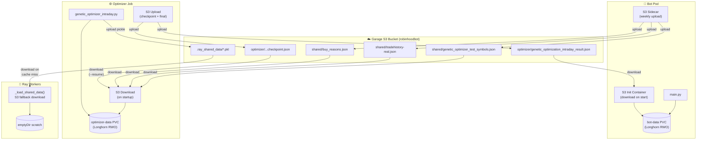

# Optimizer ↔ Bot File Sharing via Garage S3

The bot and optimizer run as separate Kubernetes workloads — the bot is a long-running Deployment while the optimizer is a batch Job backed by a Ray cluster. They each need a small set of files from the other: the bot produces trade history and symbol lists that the optimizer uses for fitness evaluation and validation, and the optimizer produces optimized parameter results that the bot loads on startup. Previously these files were shared through an NFS volume backed by Longhorn, but the RWX (ReadWriteMany) access mode required Longhorn to run an NFS share-manager pod, which introduced significant I/O latency that slowed down both workloads. To eliminate that overhead, NFS was replaced with Garage — a lightweight S3-compatible object store — backed by Longhorn RWO (ReadWriteOnce) block storage. Each pod now gets its own dedicated PVC with fast block-level performance, and the handful of small JSON files that need to cross pod boundaries are exchanged through the S3 bucket asynchronously: a sidecar in the bot pod uploads outputs weekly, and init containers in each workload download what they need at startup.

## Flow Summary

| Direction | Files | Trigger |
|-----------|-------|---------|
| **Bot → S3** | `tradehistory-real.json`, `buy_reasons.json`, `genetic_optimizer_test_symbols.json` | Sidecar uploads weekly |
| **S3 → Optimizer** | Same 3 files + checkpoint (for `--resume`) | Init download at job start |
| **Optimizer → S3** | `genetic_optimization_intraday_result.json`, checkpoint | After each generation + final save |
| **S3 → Bot** | `genetic_optimization_intraday_result.json` | Init container on pod start |
| **Optimizer → S3 → Ray Workers** | `.ray_shared_data/*.pkl` (CV folds, market data) | Upload after generation; workers download on cache miss |
