# RobinhoodBot - Detailed Documentation

## Trading Flow

The bot runs `scan_stocks()` in a continuous loop (every 5 minutes via `run.sh`). Each scan follows this flow:

```mermaid
flowchart TD
    START([scan_stocks]) --> LOGIN[Login to Robinhood & SMS]
    LOGIN --> CLEAR[Clear API Caches]
    CLEAR --> LOAD[Load Portfolio, Watchlist & Holdings]
    LOAD --> MARKET_CHECK{Check Market Conditions}
    
    MARKET_CHECK --> |Read SPY, DIA, QQQ| UPTREND{Market Uptrend?}
    MARKET_CHECK --> |Weekly comparison| DOWNTREND{Major Downtrend?}
    
    UPTREND --> SELL_SCAN
    DOWNTREND --> SELL_SCAN

    SELL_SCAN[/"🔴 SCAN PORTFOLIO FOR SELLS"\]
    SELL_SCAN --> EACH_HOLD[For each portfolio symbol]
    
    EACH_HOLD --> PENDING{Pending<br/>order?}
    PENDING -->|Yes + Market Open| CANCEL_ORDER[Cancel Stale Order]
    PENDING -->|Yes + Market Closed| SKIP_SYMBOL[Skip Symbol]
    PENDING -->|No| SET_SMA[Set SMA Periods]
    CANCEL_ORDER --> SET_SMA
    
    SET_SMA --> DYN_SMA{use_dynamic_sma?}
    DYN_SMA -->|Downtrend| USE_DOWN[n1 = short_sma_downtrend]
    DYN_SMA -->|Uptrend| USE_NORMAL[n1 = short_sma<br/>n2 = long_sma]
    USE_DOWN --> SELL_CHECKS
    USE_NORMAL --> SELL_CHECKS
    
    SELL_CHECKS[Evaluate All Sell Signals]
    SELL_CHECKS --> DC{Death Cross?<br/>SMA n1 crosses<br/>below SMA n2}
    SELL_CHECKS --> TP{Take Profit?<br/>gain ≥ take_profit_%}
    SELL_CHECKS --> SL{Stop Loss?<br/>loss ≥ stop_loss_%}
    SELL_CHECKS --> EOD{Profit Before EOD?<br/>after 1:30pm + profit}
    SELL_CHECKS --> SD{Sudden Drop?<br/>-10% in 2hr or<br/>-15% in 1hr}
    
    TP --> TP_TODAY{Traded Today<br/>& Take Profit?}
    TP_TODAY -->|Yes| ADJUST_SMA[Adjust to<br/>short_sma_take_profit /<br/>long_sma_take_profit]
    TP_TODAY -->|No| SELL_DECISION
    ADJUST_SMA --> SELL_DECISION
    
    DC --> SELL_DECISION
    SL --> SELL_DECISION
    EOD --> SELL_DECISION
    SD --> SELL_DECISION
    
    SELL_DECISION{Any sell<br/>signal triggered?}
    SELL_DECISION -->|No| HOLD[📊 HOLD - Log metrics]
    SELL_DECISION -->|Yes| DAY_TRADE_CHECK{Day trades ≤ 1<br/>OR not traded today?}
    DAY_TRADE_CHECK -->|No| BLOCKED[❌ Sell Blocked<br/>Day Trade Limit]
    DAY_TRADE_CHECK -->|Yes| EXECUTE_SELL[✅ SELL<br/>Execute Market Order]
    EXECUTE_SELL --> LOG_SELL[Log sell reason<br/>to buy_reasons.json]
    LOG_SELL --> GENETIC{Was Take Profit?}
    GENETIC -->|Yes| ADD_WATCHLIST[Add to Watchlist<br/>& Optimizer Universe]
    GENETIC -->|No| NEXT_HOLD
    ADD_WATCHLIST --> NEXT_HOLD[Next Portfolio Symbol]
    BLOCKED --> NEXT_HOLD
    HOLD --> NEXT_HOLD
    SKIP_SYMBOL --> NEXT_HOLD
    NEXT_HOLD --> EACH_HOLD
    
    NEXT_HOLD -->|All done| BUY_SCAN

    BUY_SCAN[/"🟢 SCAN WATCHLIST FOR BUYS"\]
    BUY_SCAN --> ORDER_SLOPE[Order Watchlist by<br/>Price Slope ↗️]
    ORDER_SLOPE --> EACH_WATCH[For each watchlist symbol]
    
    EACH_WATCH --> IN_PORT{Already in<br/>portfolio?}
    IN_PORT -->|Yes| NEXT_WATCH[Next Symbol]
    IN_PORT -->|No| GC{Golden Cross?<br/>SMA short crosses<br/>above SMA long<br/>within N days}
    
    GC -->|No| LOG_SKIP_GC[Log: no_golden_cross]
    GC -->|Yes| PRICE_RISING{Current price ><br/>price at cross?}
    
    PRICE_RISING -->|No| LOG_SKIP_PRICE[Log: price_below_cross]
    PRICE_RISING -->|Yes| PRICE_5HR{Current price ><br/>price 5hr ago?}
    
    PRICE_5HR -->|No| LOG_SKIP_5HR[Log: price_below_5hr]
    PRICE_5HR -->|Yes| MKT_FILTER{use_market_filter<br/>AND market uptrend<br/>AND not major downtrend?}
    
    MKT_FILTER -->|Filtered out| LOG_SKIP_MKT[Log: market_not_uptrend]
    MKT_FILTER -->|Pass| BUY_DAY_TRADE{Day trade<br/>limit OK?}
    
    BUY_DAY_TRADE -->|No| LOG_SKIP_DT[Log: day_trade_limit]
    BUY_DAY_TRADE -->|Yes| MKT_OPEN{Market open OR<br/>premium account?}
    
    MKT_OPEN -->|No| LOG_SKIP_CLOSED[Log: market_closed]
    MKT_OPEN -->|Yes| EOD_CHECK{Before 1:30pm<br/>EST?}
    
    EOD_CHECK -->|No| LOG_SKIP_EOD[Log: eod_trading_paused]
    EOD_CHECK -->|Yes| ADD_BUY[✅ Add to<br/>potential_buys]
    
    LOG_SKIP_GC --> NEXT_WATCH
    LOG_SKIP_PRICE --> NEXT_WATCH
    LOG_SKIP_5HR --> NEXT_WATCH
    LOG_SKIP_MKT --> NEXT_WATCH
    LOG_SKIP_DT --> NEXT_WATCH
    LOG_SKIP_CLOSED --> NEXT_WATCH
    LOG_SKIP_EOD --> NEXT_WATCH
    ADD_BUY --> NEXT_WATCH
    NEXT_WATCH --> EACH_WATCH
    
    NEXT_WATCH -->|All done| EXECUTE_BUYS

    EXECUTE_BUYS{Any potential<br/>buys?}
    EXECUTE_BUYS -->|No| METRICS
    EXECUTE_BUYS -->|Yes| BUY_CALC[Calculate Position Size<br/>purchase_limit_%  of equity<br/>per stock]
    BUY_CALC --> BUY_ORDER[Execute Buy Orders<br/>Market Order]
    BUY_ORDER --> LOG_BUY[Log buy reasons<br/>to buy_reasons.json]
    LOG_BUY --> METRICS

    METRICS[/"📈 UPDATE METRICS"\]
    METRICS --> GAINS[Calculate Portfolio<br/>Gains & Stats]
    GAINS --> TRADE_HIST[Update Trade History<br/>tradehistory.json]
    TRADE_HIST --> RESET{Friday evening<br/>reset_watchlist?}
    RESET -->|Yes| CLEAR_WL[Clear Watchlist<br/>except exclusion list]
    RESET -->|No| API_STATS
    CLEAR_WL --> API_STATS[Print API &<br/>Cache Stats]
    API_STATS --> DONE([Scan Complete<br/>Sleep 5 min → Repeat])

    style START fill:#4CAF50,color:white
    style DONE fill:#4CAF50,color:white
    style SELL_SCAN fill:#ff6b6b,color:white
    style BUY_SCAN fill:#51cf66,color:white
    style METRICS fill:#339af0,color:white
    style EXECUTE_SELL fill:#ff6b6b,color:white
    style ADD_BUY fill:#51cf66,color:white
    style BUY_ORDER fill:#51cf66,color:white
    style BLOCKED fill:#868e96,color:white
    style HOLD fill:#ffd43b,color:black
```



## Scan Phases

### 1. Initialization
- Login to Robinhood using cached session (pickle file)
- Clear all API caches for fresh data
- Load current portfolio symbols, watchlist symbols, and holdings data

### 2. Market Condition Assessment
- **Uptrend Check**: At least 2 of 3 indexes (SPY, DIA, QQQ) must be positive today
- **Major Downtrend Check**: Current price vs weekly open for any index below `major_downtrend_threshold_pct`
- **Momentum Check** (optional): Uses `momentum_lookback_bars` to detect falling/rising momentum

### 3. Sell Scan (Portfolio)
For each stock in the portfolio, 5 sell signals are evaluated:

| Signal | Condition | Priority |
|--------|-----------|----------|
| **Death Cross** | Short SMA crosses below Long SMA | Core signal |
| **Take Profit** | Gain ≥ `take_profit_percent` | Lock in gains |
| **Stop Loss** | Loss ≥ `stop_loss_percent` | Risk management |
| **Profit Before EOD** | After 1:30pm EST + position is profitable | Intraday exit |
| **Sudden Drop** | -10% in 2hr or -15% in 1hr | Emergency exit |

**Dynamic SMA**: In downtrends, `short_sma_downtrend` replaces `short_sma` for faster death cross detection. If take profit triggers on a same-day trade, SMAs switch to `short_sma_take_profit` / `long_sma_take_profit` to avoid day trade violations.

**Day Trade Protection**: Sells are blocked if day trade count > 1 AND the stock was already traded today (unless account equity > $25,000).

**Genetic Feedback**: Stocks that survive past take profit are re-added to the watchlist and the optimizer universe for future optimization runs.

### 4. Buy Scan (Watchlist)
Watchlist symbols are ordered by price slope (steepest positive slope first). Each symbol passes through a 6-gate filter cascade:

1. **Golden Cross** — Short SMA crossed above Long SMA within `golden_cross_buy_days`
2. **Price Rising** — Current price > price at the golden cross point
3. **Price > 5hr Ago** — Current price > price 5 hours ago (momentum confirmation)
4. **Market Filter** — Market is in uptrend AND not in major downtrend (if `use_market_filter` enabled)
5. **Day Trade Limit** — Day trades ≤ 1 OR stock not traded today
6. **Market Hours** — Market is open (or premium account) AND before 1:30pm EST (EOD filter)

### 5. Buy Execution
- Position size = `purchase_limit_percentage` of total equity per stock
- Market orders are placed for all stocks that pass all 6 gates
- Buy reasons logged to `buy_reasons.json`

### 6. Metrics & Cleanup
- Calculate portfolio gains and statistics
- Update `tradehistory.json` / `tradehistory-real.json` with completed trades
- On Friday evenings, clear the watchlist (except exclusion list stocks)
- Print API request and cache statistics

## Key Configuration Parameters

| Parameter | Description | Optimized By |
|-----------|-------------|--------------|
| `short_sma` | Short-term SMA period (hours) | Genetic Optimizer |
| `long_sma` | Long-term SMA period (hours) | Genetic Optimizer |
| `golden_cross_buy_days` | Days to look back for golden cross | Genetic Optimizer |
| `short_sma_downtrend` | Short SMA used in downtrend conditions | Genetic Optimizer |
| `short_sma_take_profit` | Short SMA after take profit (avoid day trade) | Genetic Optimizer |
| `long_sma_take_profit` | Long SMA after take profit | Genetic Optimizer |
| `take_profit_percent` | Gain % to trigger take profit sell | Genetic Optimizer |
| `stop_loss_percent` | Loss % to trigger stop loss sell | Genetic Optimizer |
| `purchase_limit_percentage` | Max % of equity per position | Genetic Optimizer |
| `slope_threshold` | Minimum slope for buy signal ordering | Genetic Optimizer |
| `uptrend_threshold_pct` | Min daily gain for market uptrend | Genetic Optimizer |
| `major_downtrend_threshold_pct` | Max weekly drop before pausing buys | Genetic Optimizer |
| `momentum_lookback_bars` | Bars to check for momentum direction | Genetic Optimizer |

## File Structure

| File | Purpose |
|------|---------|
| `main.py` | Core trading logic — `scan_stocks()` loop |
| `config.py` | All tunable parameters (SMA periods, thresholds, etc.) |
| `misc.py` | Plotting and equity data helpers |
| `tradingstats.py` | Trade history tracking and statistics |
| `robin_stocks_adapter.py` | Robinhood API wrapper with caching |
| `genetic_optimizer_intraday.py` | Genetic algorithm parameter optimizer |
| `buy_reasons.json` | Log of buy/sell reasons per trade |
| `tradehistory-real.json` | Real trade history with P&L |
| `log.json` | Structured JSON event log |
| `console_log.json` | Raw console output log |
| `genetic_optimization_intraday_result.json` | Optimizer results with best gene per generation |
| `ai_suggested_config_changelog.json` | History of AI-recommended config changes |
| `run.sh` | Main bot runner (loops `scan_stocks()` every 5 min) |
| `run_optimizer.sh` | Genetic optimizer runner with logging |

## Genetic Optimizer

The genetic optimizer (`genetic_optimizer_intraday.py`) backtests parameter combinations against real Yahoo Finance hourly OHLCV data to find optimal config values.

### Optimizer Flow

```mermaid
flowchart TD
    START([genetic_optimizer_intraday.py]) --> PARSE[Parse CLI Arguments<br/>--num-stocks, --generations,<br/>--population, --real-data, etc.]
    PARSE --> RESOLVE_SYMBOLS{Symbol Source?}
    RESOLVE_SYMBOLS -->|--num-stocks N| UNIVERSE[Select first N from<br/>~500 stock universe]
    RESOLVE_SYMBOLS -->|--symbols LIST| CUSTOM[Parse comma-separated list]
    RESOLVE_SYMBOLS -->|default| DEFAULT[AAPL, MSFT, GOOGL]
    
    UNIVERSE --> CONFIG
    CUSTOM --> CONFIG
    DEFAULT --> CONFIG
    
    CONFIG[Create IntradayGeneticConfig<br/>population, generations,<br/>mutation_rate, crossover_rate,<br/>elite_size, fitness_weights]
    CONFIG --> OPTIMIZER[Create IntradayGeneticOptimizer]
    
    OPTIMIZER --> RESUME{--resume flag<br/>& checkpoint exists?}
    RESUME -->|Yes| LOAD_CP[Load Checkpoint<br/>Restore generation,<br/>population, best_gene]
    RESUME -->|No| INIT_POP[Initialize Population]
    
    INIT_POP --> SEED_POP[Seed with 4 Defaults<br/>Conservative, Aggressive,<br/>Scalping, Main.py defaults]
    SEED_POP --> RAND_POP[Fill remaining with<br/>random genes]
    
    LOAD_CP --> DATA_DL
    RAND_POP --> DATA_DL
    
    DATA_DL{--real-data?}
    DATA_DL -->|Yes| DOWNLOAD[/"📥 Download Real Data"\]
    DATA_DL -->|No| SYNTH[Generate Synthetic<br/>Market Data]
    
    DOWNLOAD --> DL_INDEX[Download SPY, DIA, QQQ<br/>raw index data]
    DL_INDEX --> DL_SYMBOLS[Download hourly OHLCV<br/>for each symbol via yfinance]
    DL_SYMBOLS --> CACHE[Cache to disk<br/>12hr freshness]
    CACHE --> REMOVE_FAILED[Remove failed<br/>symbol downloads]
    
    REMOVE_FAILED --> EVOLUTION
    SYNTH --> EVOLUTION

    EVOLUTION[/"🧬 EVOLUTION LOOP"\]
    EVOLUTION --> GEN_START[Generation N / Total]
    
    GEN_START --> SIGTERM_CHECK{SIGTERM<br/>received?}
    SIGTERM_CHECK -->|Yes| SAVE_EXIT[Save Checkpoint<br/>& Exit Cleanly]
    SIGTERM_CHECK -->|No| EVALUATE
    
    EVALUATE[/"Evaluate Population"\]
    EVALUATE --> PARALLEL{Execution Mode?}
    PARALLEL -->|Ray| RAY_EVAL[Ray Distributed<br/>ray.put shared data<br/>ray.remote per gene]
    PARALLEL -->|Multiprocessing| MP_EVAL[Pool.map<br/>Fork with CoW globals]
    PARALLEL -->|Sequential| SEQ_EVAL[Evaluate one by one]
    
    RAY_EVAL --> EACH_GENE
    MP_EVAL --> EACH_GENE
    SEQ_EVAL --> EACH_GENE
    
    EACH_GENE[/"For Each Gene in Population"\]
    EACH_GENE --> CREATE_STRAT[Create IntradayTradingStrategy<br/>from gene parameters]
    CREATE_STRAT --> COMPUTE_MKT[Compute market conditions<br/>with gene's thresholds]
    COMPUTE_MKT --> BACKTEST[Run IntradayBacktester<br/>across all symbols × days]
    BACKTEST --> CALC_FITNESS[Calculate Weighted Fitness]
    
    CALC_FITNESS --> FIT_COMPONENTS[/"Fitness Components"\]
    FIT_COMPONENTS --> F1[Total Return 20%]
    FIT_COMPONENTS --> F2[Sharpe Ratio 25%]
    FIT_COMPONENTS --> F3[Win Rate 25%]
    FIT_COMPONENTS --> F4[Profit Factor 15%]
    FIT_COMPONENTS --> F5[Max Drawdown -10%]
    FIT_COMPONENTS --> F6[Trades/Day Bonus 5%]
    
    F1 --> PENALTIES
    F2 --> PENALTIES
    F3 --> PENALTIES
    F4 --> PENALTIES
    F5 --> PENALTIES
    F6 --> PENALTIES
    
    PENALTIES[Apply Penalties<br/>0 trades: -2.0<br/>few trades: -0.5<br/>Win/Loss ratio bonus]
    PENALTIES --> GENE_DONE[Gene fitness = score]

    GENE_DONE --> SORT[Sort population by<br/>fitness descending]
    SORT --> TRACK_BEST{New best<br/>fitness?}
    TRACK_BEST -->|Yes| UPDATE_BEST[Update best_gene<br/>& best_fitness]
    TRACK_BEST -->|No| RECORD
    UPDATE_BEST --> RECORD
    
    RECORD[Record Generation Stats<br/>best/avg/worst fitness,<br/>return%, sharpe, win_rate]
    RECORD --> SAVE_CP[💾 Save Checkpoint]
    
    SAVE_CP --> LAST_GEN{Last<br/>generation?}
    LAST_GEN -->|No| NEXT_GEN[/"Create Next Generation"\]
    LAST_GEN -->|Yes| COMPLETE
    
    NEXT_GEN --> ELITISM[Keep Top 3 Elite<br/>genes unchanged]
    ELITISM --> BREED_LOOP[Fill remaining population]
    
    BREED_LOOP --> TOURNAMENT[Tournament Selection<br/>Pick 5 random, keep best]
    TOURNAMENT --> SELECT_P1[Parent 1]
    TOURNAMENT --> SELECT_P2[Parent 2]
    
    SELECT_P1 --> CROSSOVER
    SELECT_P2 --> CROSSOVER
    
    CROSSOVER{Crossover<br/>70% chance}
    CROSSOVER -->|Yes| UNIFORM[Uniform Crossover<br/>Each param randomly<br/>from parent1 or parent2]
    CROSSOVER -->|No| CLONE[Clone parents]
    
    UNIFORM --> MUTATE
    CLONE --> MUTATE
    
    MUTATE[/"Mutation (15% per param)"\]
    MUTATE --> M1[SMA periods ±5-15]
    MUTATE --> M2[Stop loss ±2%]
    MUTATE --> M3[Take profit ±0.3%]
    MUTATE --> M4[Position size ±5%]
    MUTATE --> M5[Thresholds ±delta]
    MUTATE --> M6[Boolean flips<br/>if --optimize-filters]
    
    M1 --> ENFORCE[Enforce long_sma > short_sma]
    M2 --> ENFORCE
    M3 --> ENFORCE
    M4 --> ENFORCE
    M5 --> ENFORCE
    M6 --> ENFORCE
    
    ENFORCE --> CHILD[Add child to<br/>next generation]
    CHILD --> BREED_LOOP
    
    CHILD -->|Population full| GEN_START

    COMPLETE[/"✅ OPTIMIZATION COMPLETE"\]
    COMPLETE --> CLEANUP[🧹 Remove checkpoint file]
    CLEANUP --> SUMMARY[Print Evolution Summary<br/>& Best Configuration]
    
    SUMMARY --> VALIDATE{--validate-real?}
    VALIDATE -->|Yes| LOAD_REAL[Load tradehistory-real.json<br/>& buy_reasons.json]
    VALIDATE -->|No| SAVE_RESULTS
    
    LOAD_REAL --> COMPARE[Compare gene params<br/>vs real trade performance]
    COMPARE --> ALIGN_CHECKS[/"Alignment Checks"\]
    ALIGN_CHECKS --> A1[Take Profit vs<br/>real avg profit]
    ALIGN_CHECKS --> A2[Stop Loss vs<br/>real avg loss]
    ALIGN_CHECKS --> A3[Expected Win Rate vs<br/>real win rate]
    ALIGN_CHECKS --> A4[Exit Reason Mix<br/>gene vs real]
    ALIGN_CHECKS --> A5[Risk Profile<br/>Sharpe & Drawdown]
    
    A1 --> SCORE[📈 Alignment Score 0-5]
    A2 --> SCORE
    A3 --> SCORE
    A4 --> SCORE
    A5 --> SCORE
    
    SCORE --> SAVE_RESULTS
    
    SAVE_RESULTS[Save Results to<br/>genetic_optimization_intraday_result.json]
    SAVE_RESULTS --> DONE([Done<br/>Print runtime])

    style START fill:#7c3aed,color:white
    style DONE fill:#7c3aed,color:white
    style EVOLUTION fill:#f59e0b,color:black
    style EVALUATE fill:#ef4444,color:white
    style EACH_GENE fill:#ef4444,color:white
    style FIT_COMPONENTS fill:#3b82f6,color:white
    style NEXT_GEN fill:#10b981,color:white
    style COMPLETE fill:#22c55e,color:white
    style DOWNLOAD fill:#06b6d4,color:white
    style MUTATE fill:#f97316,color:white
    style ALIGN_CHECKS fill:#8b5cf6,color:white
    style SAVE_EXIT fill:#dc2626,color:white
```



### Optimizer Phases

1. **Initialization** — Parse CLI args, resolve symbols (from universe or explicit list), configure genetic algorithm parameters
2. **Population Seeding** — 4 preset strategies (conservative, aggressive, scalping, main.py defaults) + random genes to fill population
3. **Data Download** — With `--real-data`, downloads hourly OHLCV from Yahoo Finance for all symbols + SPY/DIA/QQQ index data (cached 12hr)
4. **Evolution Loop** — For each generation:
   - Evaluate all genes in parallel (Ray distributed, multiprocessing, or sequential)
   - Each gene runs a full intraday backtest across all symbols × 60 trading days
   - Fitness = weighted sum of return (20%), Sharpe (25%), win rate (25%), profit factor (15%), drawdown penalty (10%), trades/day bonus (5%)
   - Track best gene, save checkpoint after each generation
5. **Next Generation** — Top 3 elite genes preserved unchanged, remaining bred via tournament selection → uniform crossover (70%) → mutation (15% per param)
6. **Validation** — With `--validate-real`, compares best gene against real trade history for alignment scoring (0-5)
7. **Output** — Results saved to `genetic_optimization_intraday_result.json`

### Graceful Shutdown
- SIGTERM/SIGINT saves checkpoint and exits cleanly
- Resume with `--resume` to continue from last completed generation
- Checkpoint file auto-removed on successful completion

### Usage
```bash
cd ~/dev/RobinhoodBot/robinhoodbot && \
LOG_FILE=/tmp/optimizer_run.log ./run_optimizer.sh \
  --num-stocks 125 \
  --max-positions 10 \
  --generations 30 \
  --population 40 \
  --real-data \
  --resume \
  --validate-real
```

### Fitness Function
Weighted combination of:
- Total return % (20%)
- Sharpe ratio (25%)
- Win rate (25%)
- Profit factor (15%)
- Max drawdown penalty (10%)
- Trades per day bonus (5%)

### Real Trade Validation
With `--validate-real`, the optimizer compares its best gene against actual trade history in `tradehistory-real.json` and scores alignment (0-5) across take profit, stop loss, win rate, exit reason mix, and risk profile.
